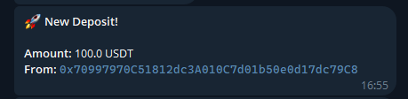

# Telegram Wallet Notifier

A real-time monitoring tool built to track crypto wallet transactions and send instant notifications via Telegram.

## 🚀 Overview

This project monitors specific wallet addresses on-chain and triggers Telegram alerts whenever a new deposit or transaction is detected. Built with TypeScript and Foundry for blockchain testing.



## 🛠️ Tech Stack

* **Language:** TypeScript
* **Blockchain Framework:** [Foundry](https://book.getfoundry.sh/getting-started/installation) (Forge & Cast)
* **API:** Telegram Bot API
* **Runtime:** Node.js

## 📦 Getting Started

### Prerequisites

* Node.js & npm/yarn installed.
* Foundry installed.
* A Telegram Bot Token (from [@BotFather](https://t.me/botfather)).
* An RPC URL (Infura, Alchemy, or a local Anvil instance).


## 🧪 Local Testing with Anvil
You can use the provided cheat codes to test the bot locally using Anvil or execute the commands available in `package.json`

1. Start a local node 
    ```bash
    anvil --fork-url https://eth-mainnet.g.alchemy.com/v2/{YOUR_ALCHEMY_KEY}
    ``` 
2. Deposit USDT in your wallet by running command
    ```
    npm run local:test:usdt:deposit
    ```
3. Check if balance deposit was successful
    ```
    npm run local:test:usdt:balance
    ```
4. Transfer funds
    ```
    npm run local:test:usdt:transfer
    ```
    
